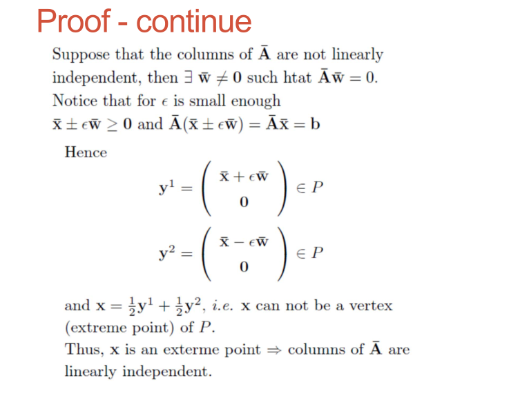
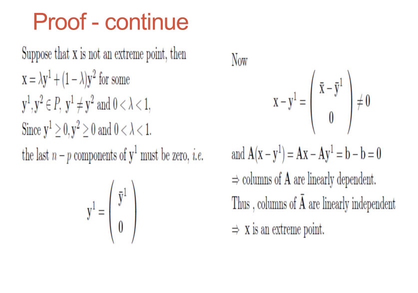

# Geometry of LP

你认为一个标准线性规划的问题，解的可能情况有几种？

1. 无解
2. 有最小值
3. 负无穷

## Terminologies

——几何直觉，代数证明

1. 有界的可行域有界（可行域内的可行解的2范数存在上界）=> 线性规划有界（可行域内取到的目标函数的值恒大于某一常数），反之不一定成立

2. **超平面（hyperplane）** $H = \left\{ \bold{x}\in R^n \mid \bold{a}^T \bold{x} = \beta \right\}$

   线性规划中的等式约束称为超平面，超平面将空间分为三部分超平面$H$、lower halfspace $H_L$、upper half halfspace $H_U$。

   超平面法线朝向正半空间（简单证明：任一从超平面指向负半平面的向量与法向量的向量积小于0，即与法线向量所呈角大于90°）。

   * $H_L = \left\{ \bold{x}\in R^n \mid \bold{a}^T \bold{x} \ge \beta \right\}$ lower halfspace, close halfspace 
   * $H_U = \left\{ \bold{x}\in R^n \mid \bold{a}^T \bold{x} \le \beta \right\}$ upper halfspace, close halfspace 
   * $H_L^i = \left\{ \bold{x}\in R^n \mid \bold{a}^T \bold{x} < \beta \right\}$ lower halfspace, open halfspace 
   * $H_U^i = \left\{ \bold{x}\in R^n \mid \bold{a}^T \bold{x} > \beta \right\}$ upper halfspace, open halfspace 

3. 有限个闭半空间的交集称为**多面集合（polyhedral set or polyhedron）**，如果有界则称为**多面体（polytope）**。超平面也是一个多面体（由它的两个闭半空间交集得到）。

4. 对于标准形式，其可行域P是若干超平面与（第一象限+正坐标轴）的交集，因此也是一个多面集合。而线性规划的最优解可以通过目标函数的成本向量构成的超平面与约束条件形成的多面集合的交集找到。

   1. 如果P非空，且存在$\beta \in \bold{R}$使得
      $$
      P \subset H_L = \left\{\bold{x}\in \bold{R}^n \mid-\bold{c}^T\bold{x} \le \beta\right\}
      $$
      那么，$\bold{c}^T\bold{x}$在可行域上的最小值将大于等于$-\beta$。如果那个最小值对应的$\bold{x}$恰好属于$P\cap H$，那么最小值取到$-\beta$。回看第一点，可由此性质推出。

   2. 线性规划如果有解，则解一定在可行域的顶点（vertex）上（注：边界也包含顶点），聚焦于vertices。

5. 至此，几何意义基本明确，但对于高维问题，难以通过几何图像来求解。由此引出单纯形法（Simplex method）。但目前我们之前只是intuition，没有convincing的代数证明。

## Background knowledge

——轿夫与坐轿子的人，无限列车

1. **线性组合**、**仿射组合**、**锥组合**、**凸组合**
   $$
   \bold{x} = \sum_{i=1}^{p}\lambda_i \bold{x}_i
   $$

   * 线性组合：$\lambda_1,\dots,\lambda_p\in R$ 二维下为全平面 
   * 仿射组合：$\lambda_1,\dots,\lambda_p\in R$，$\sum_{i=1}^{p}\lambda_i = 1$ 二维下为直线 
   * 锥组合：$\lambda_1,\dots,\lambda_p\in R$，$\lambda_i\ge0$ 二维下为第一象限+正坐标轴
   * 凸组合：$\lambda_1,\dots,\lambda_p\in R$，$\sum_{i=1}^{p}\lambda_i = 1,\ \lambda_i\ge0$ 二维下为线段

   可推知：凸组合是仿射组合，反之不成立（除非$\bold{x}_i$均相等）；锥和线的交集是线段。

2. **仿射集**、**锥集**、**凸集**

   * 对于集合S，若对于S内任意两点的仿射组合都在S内，则S是一个仿射集
   * 对于集合S，若对于S内任意两点的锥组合组合都在S内，则S是一个锥集
   * 对于集合S，若对于S内任意两点的凸组合都在S内，则S是一个凸集

   可推知：一个仿射集一定是凸集，反之不成立。一个锥集一定是凸集，反之不成立.

   集合$\left\{\bold{x}\in R^n \mid \bold{A}\bold{x} = \bold{b}\right\}$是仿射的（因此也是凸的），但线性规划的可行域$P=\left\{\bold{x}\in R^n \mid \bold{A}\bold{x} = \bold{b},\ \bold{x}\ge0\right\}$仅是凸的，非仿射。但若把$\bold{A}$中每一列（每一列为$m$维的列向量）当作变量，将$\bold{x}$中每一元素看作系数，可以发现$P$也是一个锥。
   $$
   x_1 A_1 +x_2A_2+\cdots+x_nA_n = \bold{b}\\
   \bold{A}= \left[A_1\ A_2 \cdots A_n\right]
   $$
   即，$m$维和$n$维空间里线性规划的可行解有不同几何表达。

3. **内点**、**边界点**

   给定一个集合$S\subset R^n$，对于集合中元素$\bold{x}$，如果存在一个常量$\epsilon>0$使得the open ball $B=\left\{\bold{y}\in R^n \mid \Vert \bold{x} - \bold{y}\Vert<\epsilon\right\}\subseteq S$，则称$\bold{x}$为$S$的一个内点，否则$\bold{x}$为$S$的一个边界点。

   **从内部看**，一个凸集具有这样的性质：凸集内的任意两点所连线段都在凸集内

   **从外部看**，一个凸集具有这样的性质：对于凸集任意边界上的一点，都存在一个超平面使得其下半空间包含该凸集，且该超平面与该凸集交集非空。（Separation Theorem）

4. **极点**

   **代数上**，极点的定义：如果凸集中的元素$x$无法由凸集中其他点的凸组合表示，那么称$x$是凸集的一个极点。

   **几何上**，顶点（vertex）、边（edge）、面（facet）的几何定义：

   Let $P$ be a convex polyhedron and $H$ be a supporting hyperplane of $P$, then $F = P\cap H$ defines a face of $P$.

   * dim($F$) = 0, it is a vertex
   * dim($F$) = 1, it is an edge
   * dim($F$) = dim($P$) - 1, a facet

   **有定理：**Let $P$ be a convex polyhedron, $x \in P$ is a vertex if and only if $x$ is an extreme point of $P$.

   对于线性规划的可行域，它的顶点就是极点，而极点肯定满足约束（属于可行域）。

5. **寻找极点**

   **观察：**从例子中发现，对于$\bold{A}\bold{x}=\bold{b}$的线性规划的可行域的顶点维数均为$n-m$维（假定变量数$n$大于线性方程组的个数$m$。因此可通过令$n-m$个变量为0，求解$m$维线性方程组，即可得到可能的极点。利用极点的代数性质可以把极点全部求出来，组合的可能有$n \choose n-m$种，然后排除不满足不等式条件的极点。

   **定理：**线性规划的可行域内的一点是极点当且仅当令$n-m$个变量为0后矩阵$A$剩余的$m$个列向量线性无关。

   **最终可证明：**$x$是极点<==>$\bar{A}$线性无关
   $$
   \bold{x}=\left(
   \begin{array}{c}
   	 \bar{\bold{x}}  \\
   	 0
   \end{array}
   \right),
   \mathrm{where}\ 
   \bar{\bold{x}}=\left(
   \begin{array}{c}
   	x_1 \\
   	\cdots\\
   	x_p
   \end{array}
   \right)>0
   $$
   同时记矩阵$\bold{A}$的前$p$列为$\bar{\bold{A}}$，然后有$\bold{A}\bold{x}=\bar{\bold{A}}\bar{\bold{x}}=\bold{b}$。

   

   注：$\bold{A}_{m\times n},\ m\le n$若行满秩，并不意味着从$\bold{A}$任意选出的$m$列是线性无关的。

   以上都没有刻意讨论一种情况——目标值的最小值为负无穷，将会揭晓：

6. **求解！**

   1. 假设矩阵$\bold{A}$行满秩，则通过行交换和列交换可得$\bold{x}=\left(\begin{array}{c} \bold{x}_B\\\bold{x}_N\end{array}\right)$，$\bold{A}=\left(\bold{B}\mid \bold{N}\right)$，其中B代表basic variables，N代表non-basic variables，$\bold{x}_N=0$，由此可通过$\bold{Ax}=\bold{B}\bold{x}_B=\bold{b}$解出$\bold{x}_B$，从而得到的$\bold{x}$称为一个basic solution。如果$\bold{x}_B\ge0$，那么$\bold{x}$为basic feasible solution。
   2. 如果$\bold{A}$不满秩那么：
      1. $\bold{Ax=b}$无解，因此可行域为空；
      2. 部分约束条件重复，此种情况将重复的条件剔除后$\bold{A}$重新变为满秩。
   3. 推论：
      1. 可行域种的一点$\bold{x}$是可行域的一个极点当且仅当$\bold{x}$是关于某个$\bold{B}$矩阵的basic feasible solution。
      2. 多面集合的可行域有有限个极点，不超过$C\left(n,m\right)$。

7. **extremal direction**

   1. 对于非空的多面体可行域（本文所有可行域均默认为线性规划的可行域），可行域内任意一点可表示为可行域所有极点的凸组合。

   2. 如果可行域无界，则引入extremal direction，A vector is an extremal direction of P, if $\left\{x\in\bold{R}^n\mid \bold{x}=\bold{x}^0+\lambda\bold{d},\ \lambda\ge0\right\}\subset P$ for all $\bold{x}^0\in P$。

      1. 可行域无界 <==> 有extremal direction
      2. $\bold{d}$是可行域的extremal direction <==> $\bold{Ad}=0$且$\bold{d}\ge 0$。

   3. **Resolution theorem** [多面集的相关定理证明](https://blog.csdn.net/phoenix198425/article/details/79341247)

      令$V=\left\{v^u\in\bold{R}^n\mid i\in I\right\}$是可行域所有极点的集合，则对于可行域中任一点有$\bold=\sum_{i\in I}\lambda_i v^i+\bold{d}$，其中，$\sum_{i\in I}\lambda_i=1,\ \lambda_i\ge  0\ \forall i\in I$，$\bold{d}$为零向量或可行域的extremal direction。

   4. **Fundamental theorem of LP**

      对于标准形式的线性规划问题，如果其可行域非空，则目标函数最优值要么是负无穷，要么就在可行域的极点上取到。